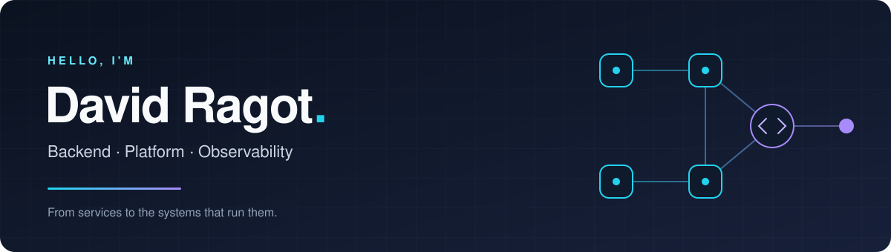

  

  <strong>I build backend services and the infrastructure that keeps them running.</strong> 
  Go, distributed systems, Kubernetes — and a clear view of what happens in production.

  
  
  

---

### ⚡ Where I spend my time

<table>
  <tr>
    <td width="50%" valign="top">
      <h3>🛠️ Backend &amp; platform</h3>
      
Services, APIs, and integrations in Go. Container orchestration, delivery pipelines, and the tooling that connects them.

    </td>
    <td width="50%" valign="top">
      <h3>📡 Observability &amp; reliability</h3>
      
Metrics, traces, and dashboards that help explain system behavior and make operational problems easier to diagnose.

    </td>
  </tr>
</table>

### 🧰 Tools of the trade

**Languages**

**Platform**

**Observability**

### 🔌 Away from the backend

I also explore embedded systems and IoT — taking ideas from code to hardware.

---

  Let's talk backends, infrastructure, observability — or what you're building next.

